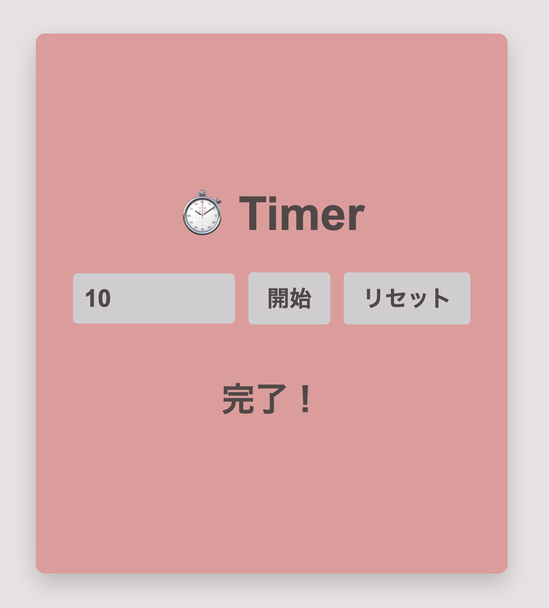

# ⏱️ カウントダウンタイマー

指定した秒数からカウントダウンし、0になったら「完了！」と表示するタイマーです。

## スクショ

## 使い方

1. `index.html` をブラウザで開く
2. 秒数を入力して「開始」をクリック
3. カウントダウンが開始され、0になったら「完了！」と表示されます

## 機能

- `countdown(seconds)` 関数でカウントダウンを開始
- 1秒ごとに残り秒数を表示
- 0になったら「完了！」を表示
- リセット機能対応
